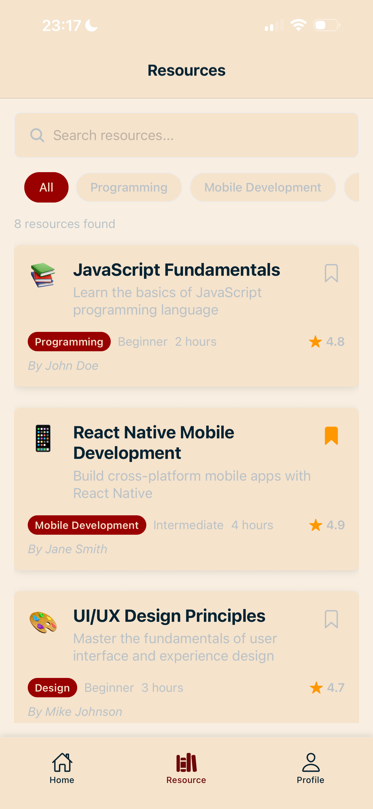

# N322 — Student Hub React Native App

This project is a modern student learning hub built with React Native and Expo, featuring tab navigation, resource management, authentication, and a consistent design system.

<div style="display: flex; justify-Content: space-around;">  </div>

## Features

- **React Navigation**: Tab navigator with nested stack navigators for complex routing
- **Authentication System**: Login and account creation with form validation and state management
- **Resource Management**: Browse, search, and filter learning resources with detailed views
- **Design System**: Centralized theming with Colors, Typography, Spacing, and CommonStyles
- **Resource Discovery**: FlatList implementation with search and category filtering
- **User Profiles**: Dashboard with learning statistics, bookmarks, and account management
- **Form Validation**: Email validation, password requirements, and user feedback
- **Responsive UI**: Consistent styling across all screens with proper spacing and typography

## Screens

- **Home**: Dashboard with quick actions, recent activity, and study statistics
- **Resources**: Browse learning resources with search, filter, and category organization
- **Resource Details**: Detailed resource view with bookmark functionality
- **Profile**: User authentication, account management, and learning progress tracking
- **Login**: Secure login form with validation and loading states
- **Create Account**: Registration form with password confirmation and comprehensive validation

## Setup & Installation

1. **Prerequisites**: Ensure you have Node.js, npm, and Expo CLI installed

2. **Clone or download the project** and navigate to the student-hub folder:

   ```bash
   cd student-hub
   ```

3. **Install dependencies**:

   ```bash
   npm install
   ```

4. **Start the development server**:

   ```bash
   npx expo start
   ```

5. **Run on device/simulator**:
   - Press `i` for iOS simulator
   - Press `a` for Android emulator
   - Scan QR code with Expo Go app on physical device

## Project Structure

```
student-hub/
├── App.js                     # Main app component with navigation structure
├── package.json               # Project dependencies and scripts
├── app.json                   # Expo configuration
├── index.js                   # Entry point
├── CommonStyles.js            # Centralized design system and theming
├── screens/
│   ├── HomeScreen.js          # Dashboard with quick actions and activity
│   ├── ResourcesScreen.js     # Resource browsing with search and filtering
│   ├── DetailsScreen.js       # Detailed resource view with bookmarks
│   ├── ProfileScreen.js       # User profile and authentication hub
│   ├── LoginScreen.js         # Login form with validation
│   └── CreateAccountScreen.js # Registration form with validation
├── assets/
│   ├── icon.png              # App icon
│   ├── splash-icon.png       # Splash screen icon
│   ├── favicon.png           # Web favicon
│   └── adaptive-icon.png     # Android adaptive icon
└── resourcesData.js          # Mock data for learning resources
```

## Navigation Architecture

- **RootTab Navigator**: Three main tabs (Home, Resources, Profile)
- **HomeStack**: Home dashboard
- **ResourceStack**: Resource browsing and detailed views
- **ProfileStack**: Authentication and profile management screens

## Key Features Implementation

### **Authentication Flow**

- Callback pattern for state management between screens
- Form validation with real-time feedback
- Loading states during async operations
- Proper error handling and user feedback

### **Resource Management**

- FlatList with optimized rendering for large datasets
- Search functionality with real-time filtering
- Category-based organization
- Navigation parameter passing for detailed views

### **State Management**

- Local state with useState hooks
- Screen focus effects for navigation updates
- Callback functions for cross-screen communication
- Persistent user session handling

## Technologies Used

- **React Native**: Cross-platform mobile development framework
- **Expo**: Development platform and toolchain for React Native
- **React Navigation**: Navigation library with tab and stack navigators
- **Expo Vector Icons**: Icon system using Ionicons
- **JavaScript ES6+**: Modern JavaScript with hooks and async/await
- **StyleSheet API**: React Native styling system

## Testing

- Test authentication flow with the "Test Login (Debug)" button
- Verify resource browsing, searching, and filtering functionality
- Check form validation on login and registration screens
- Test navigation between all screens and tab switching
- Verify responsive design on different screen sizes

---

Built with React Native and Expo for N322 Mobile Application Development
